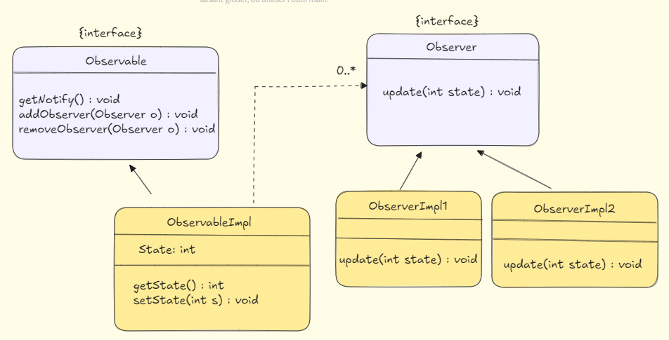

# Pattern de Conception Observateur

Le **Pattern de Conception Observateur** est un pattern comportemental utilisé pour gérer les relations entre un sujet et plusieurs observateurs. Ce pattern définit une dépendance un-à-plusieurs entre les objets, où un changement dans l'objet sujet notifie et met automatiquement à jour tous les objets observateurs. Cela aide à découpler le sujet des observateurs, rendant le système plus flexible et facile à maintenir.

## Structure

Le pattern Observateur comporte généralement les composants suivants :

1. **Sujet** : Gère et met à jour une liste d'observateurs, les notifie des changements.
2. **Observateur** : Reçoit les mises à jour du sujet et réagit en conséquence.
3. **Sujet Concret** : Implémente l'interface du sujet et maintient l'état.
4. **Observateur Concret** : Implémente l'interface de l'observateur et se met à jour en fonction des notifications du sujet.



## Quand Utiliser le Pattern Observateur

1. **Lorsque plusieurs objets doivent se mettre à jour en réponse aux changements d'un seul objet.**
    - Exemple : Un site d'actualités où les mises à jour du fil d'actualités principal notifient et rafraîchissent les pages des abonnés.

2. **Lorsque vous souhaitez découpler les objets pour les rendre plus modulaires et indépendants.**
    - Exemple : Un système d'inventaire où les changements dans les quantités de produits mettent automatiquement à jour les notifications des clients, l'inventaire des fournisseurs, etc.

3. **Systèmes basés sur les événements où les changements dans une partie de l'application doivent déclencher des actions ailleurs.**
    - Exemple : Applications de chat où l'envoi d'un message notifie tous les utilisateurs actifs dans le chat.

## Exemple du Monde Réel : Station Météo

Considérons un système de station météo qui notifie plusieurs dispositifs (par exemple, applications mobiles, écrans d'affichage) chaque fois que les données météorologiques sont mises à jour.

- **Sujet** : Station Météo
- **Observateurs** : Écrans d'affichage, Applications mobiles, etc.

## Diagramme UML

Le diagramme UML suivant montre comment le Pattern Observateur est structuré :


## Exemple de Code

Voici une implémentation Java du Pattern Observateur :

```java
// Interface Observable
public interface Observable {
    void addObserver(Observer observer);
    void removeObserver(Observer observer);
    void notifyObservers();
}

// Interface Observer
public interface Observer {
    void update(int state);
}

// Observateur Concret : Couloir
public class Couloir implements Observer {
    @Override
    public void update(int state) {
        System.out.println("Couloir: " + state);
    }
}

// Observateur Concret : Jardin
public class Garden implements Observer {
    @Override
    public void update(int state) {
        System.out.println("Garden: " + state);
    }
}

// Sujet Concret : Joueur
import java.util.ArrayList;

public class Player implements Observable {
    public ArrayList<Observer> observerArrayList = new ArrayList<>();

    private int score;

    @Override
    public void addObserver(Observer observer) {
        observerArrayList.add(observer);
    }

    @Override
    public void removeObserver(Observer observer) {
        observerArrayList.remove(observer);
    }

    @Override
    public void notifyObservers() {
        for (Observer observer : observerArrayList) {
            observer.update(this.getScore());
        }
    }

    public void setScore(int score) {
        this.score = score;
        notifyObservers();
    }

    public int getScore() {
        return score;
    }
}

// Utilisation
public class Main {
    public static void main(String[] args) {
        // Observateurs
        Camera camera = new Camera();
        Couloir couloir = new Couloir();
        Garden garden = new Garden();

        Player p = new Player();

        // Abonner les observateurs
        p.addObserver(camera);
        p.addObserver(couloir);
        p.addObserver(garden);

        // Changement du score du joueur
        p.setScore(10);
        p.setScore(20);
        p.setScore(30);
    }
}