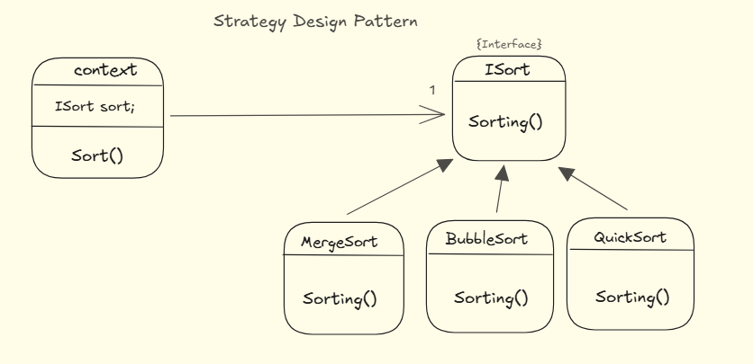

# Exemple de Pattern de Stratégie

Ce projet démontre l'utilisation du pattern de conception Stratégie en Java. Le pattern de stratégie permet de définir une famille d'algorithmes, de les encapsuler dans des classes séparées et de les rendre interchangeables. Cela permet de modifier l'algorithme utilisé par un objet sans modifier le code de cet objet.

## Structure du Projet

Le projet est structuré comme suit :

- `ISort.java` : Interface définissant la méthode de tri.
- `BubbleSort.java` : Implémentation de l'algorithme de tri à bulles.
- `MergeSort.java` : Implémentation de l'algorithme de tri par fusion.
- `QuickSort.java` : Implémentation de l'algorithme de tri rapide.
- `Context.java` : Classe qui utilise une stratégie de tri.
- `Main.java` : Classe principale pour exécuter l'exemple.

## Utilisation

Dans cet exemple, nous avons trois algorithmes de tri : `BubbleSort`, `MergeSort` et `QuickSort`. La classe `Context` permet de définir la stratégie de tri à utiliser et d'exécuter le tri sur un tableau donné.

### Exemple de Code

```java
public class Main {
    public static void main(String[] args) {
        int[] arr = { 64, 34, 25, 12, 22, 11, 90 };

        Context context = new Context();

        context.setSortStrategy(new BubbleSort());
        context.search(arr, 22);
        context.setSortStrategy(new MergeSort());
        context.search(arr, 90);
    }
}